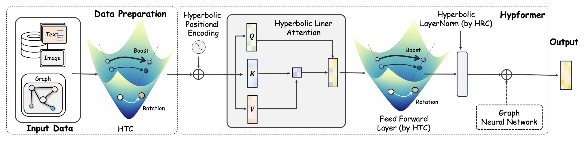

# [Hypformer: Exploring Efficient Transformer Fully in Hyperbolic Space](https://dl.acm.org/doi/10.1145/3637528.3672039)

[](https://arxiv.org/abs/2407.01290)
[](https://kdd.org/kdd2024/)
[](https://opensource.org/licenses/MIT)

This is the PyTorch implementation of the paper ["Hypformer: Exploring Efficient Transformer Fully in Hyperbolic Space"](https://dl.acm.org/doi/10.1145/3637528.3672039) to be presented at KDD 2024.


Menglin Yang, Harshit Verma, Delvin Ce Zhang, Jiahong Liu, Irwin King, Rex Ying

Arxiv: https://arxiv.org/abs/2407.01290

ACM: https://dl.acm.org/doi/10.1145/3637528.3672039

Code: https://github.com/Graph-and-Geometric-Learning/hyperbolic-transformer

## Framework



## Updates (August 17, 2025 🔥)

- [x] Large-scale graph evaluation
- [x] Medium-scale graph evaluation
- [x] Image and text data evaluation
- [x] Simplified version for reusage
- [ ] Baselines (To be updated)

## 1. Requirements

To install the required packages, run:

```bash
pip install -r requirements.txt
```

## 2. Dataset

Please check the `./data` folder for available datasets.

Note: OGB datasets will be downloaded automatically when needed.

## 3. Run Hyperbolic Transformer

The code has been evaluated on NVIDIA A100 GPUs.

To run the code:

1. Navigate to the `large` directory: `cd large`

2. Check the `example` folder, where the `5-runs` folder contains scripts to get averaged results.

3. For a single run, execute one of the following commands:
   ```bash
   bash examples/amazon2M.sh
   bash examples/arxiv.sh
   bash examples/proteins.sh
   ```
4. Navigate to the `medium` directory: `cd medium`. For a single run, execute one of the following commands:

   ```bash
   bash examples/cora.sh
   bash examples/citeseer.sh
   bash examples/pubmed.sh
   bash examples/airport.sh
   ```

## 4. Reuse Hyperbolic Transformer Modules

To reuse the Hyperbolic Transformer modules, please check the folder `./Hypformer`

for example:
`Hyperbolic LayerNorm` in [hyp_layer.py](./Hypformer/manifolds/hyp_layer.py)

```python
import torch
import torch.nn as nn
class HypLayerNorm(nn.Module):
    def __init__(self, manifold, in_features, manifold_out=None):
        super(HypLayerNorm, self).__init__()
        self.in_features = in_features
        self.manifold = manifold
        self.manifold_out = manifold_out
        self.layer = nn.LayerNorm(self.in_features)
        self.reset_parameters()

    def reset_parameters(self):
        self.layer.reset_parameters()

    def forward(self, x):
        x_space = x[..., 1:]
        x_space = self.layer(x_space)
        x_time = ((x_space**2).sum(dim=-1, keepdims=True) + self.manifold.k).sqrt()
        x = torch.cat([x_time, x_space], dim=-1)

        if self.manifold_out is not None:
            x = x * (self.manifold_out.k / self.manifold.k).sqrt()
        return x
```

- `Hyperbolic Linear Transformation` in [hyp_layer.py](./Hypformer/manifolds/hyp_layer.py)
- `Hyperbolic Dropout Operations` in [hyp_layer.py](./Hypformer/manifolds/hyp_layer.py)
- `Hyperbolic Activation Operations` in [hyp_layer.py](./Hypformer/manifolds/hyp_layer.py)
- `Hyperbolic Classification Layer` in [hyp_layer.py](./Hypformer/manifolds/hyp_layer.py)
- `Hyperbolic full/linear Attention` in [hypformer.py](./Hypformer/hypformer.py)

## 5. Acknowledgments

This project was heavily built upon the following projects. We thank the authors for their awesome contributions:

- SGFormer - https://github.com/qitianwu/SGFormer
- HGCN - https://github.com/HazyResearch/hgcn/tree/master
- fully HNN - https://github.com/chenweize1998/fully-hyperbolic-nn
- Open Graph Benchmark - https://ogb.stanford.edu/
- Geoopt - https://github.com/geoopt/geoopt
- GrapGPS - https://github.com/rampasek/GraphGPS
- Graphformer - https://github.com/microsoft/GraphFormers
- GraphTrans - https://github.com/ucbrise/graphtrans
- Nodeformer - https://github.com/qitianwu/NodeFormer

## Citation

If you find this work useful in your research, please consider citing our paper:

```bibtex
@inproceedings{yang2022hypformer,
  title={Hypformer: Exploring Efficient Hyperbolic Transformer Fully in Hyperbolic Space},
  author={Yang, Menglin and Verma, Harshit and Zhang, Delvin Ce and Liu, Jiahong and King, Irwin and Ying, Rex},
  booktitle={Proceedings of the 2024 ACM SIGKDD International Conference on Knowledge Discovery and Data Mining},
  year={2024}
}
```

## License

This project is licensed under the MIT License - see the [LICENSE](./LICENSE) file for details.

## Contact

For any questions or concerns, please open an issue in this repository or contact menglin.yang@{yale.edu,outlook.com}